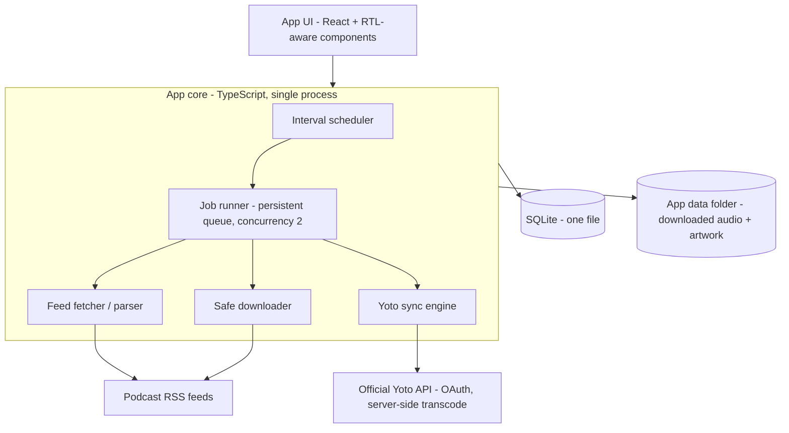

# Yoto Podcast Manager — Desktop App Specification

## 0. What changed from v1.1 and why

v1.1 described a self-hosted platform: Next.js + API + scheduler + workers, PostgreSQL, Redis/BullMQ, reverse proxy, Docker Compose, multi-tenant workspaces, RBAC, backup drills. That is a small SaaS company's stack, and it conflicts with the two stated priorities: easy to use, and installable as an app rather than infrastructure.

Two findings drive the rewrite:

1. **The official Yoto API transcodes audio server-side.** The documented MYO upload flow is: request an upload URL, PUT the file, poll until Yoto returns a `transcodedSha256`, then create/update the playlist content object referencing `yoto:#<sha>`. Yoto normalizes the audio itself. This removes the need for the entire FFmpeg pipeline (loudnorm profiles, AAC settings, profile-versioned immutable storage) on the sync path. Local audio processing becomes an optional nice-to-have, not core.
2. **A single-user desktop app needs none of the platform machinery.** SQLite replaces PostgreSQL. An in-process job runner replaces Redis/BullMQ/scheduler/worker services. There is no proxy, no TLS management, no RBAC, no workspaces, no invitations, no Compose. Backup is "copy one folder" plus an export button.

Kept from v1.1 because they were genuinely good: the safe downloader rules (SSRF/redirect handling), episode deduplication order, episode/playlist state machines (simplified), manual-export fallback when the API can't do something, plain-language errors with a recommended action, Hebrew/RTL per-field handling, and the cautious treatment of the three initial podcasts.

Dropped entirely: workspaces/tenancy, RBAC and invitations, OIDC, Postgres/Redis/proxy/Compose, FFmpeg normalization profiles, EBU R128 loudness pipeline, content-addressed immutable media store, Prometheus/Grafana/OpenTelemetry, backup/restore drills, RPO/RTO targets, dead-letter queues, hosted-offering roadmap. If a hosted product is ever wanted, that is a different codebase with a different spec — carrying dormant multi-tenant scaffolding in a family desktop app is cost with no payoff.

## 1. Purpose

An installable desktop app that keeps a Yoto player stocked with fresh, curated podcast episodes. The user adds an RSS feed (or drops in audio files), picks simple rules ("keep the latest 10"), links a MYO card, and the app keeps that card up to date through the official Yoto API. Non-technical users must succeed without reading documentation.

Note: the Yoto app itself can already link some podcasts to cards as *streaming* content. This app exists for what that feature doesn't cover: uploaded (offline-playable) episodes, curation and ordering, episode limits and cleanup, local files, and Hebrew feeds handled correctly.

## 2. Product goals

- Install like a normal app: download, open, sign in to Yoto, add a feed, done.
- First ready card within 10 minutes of first launch; adding a feed takes under 3 minutes.
- Automate: feed checking, episode download, upload to Yoto, playlist update, old-episode cleanup.
- Every failure states in plain language what happened, whether existing content on the card is safe, and one recommended action.
- Full support for Hebrew and mixed-direction metadata; WCAG 2.2 AA targets.
- Work offline gracefully: queue work, resume when back online.

Non-goals:

- Public playback, redistribution, or bypassing DRM/auth/rate limits.
- Multi-user accounts, roles, hosting, or any server component.
- Undocumented/reverse-engineered Yoto endpoints, or automating the Yoto consumer web UI.

## 3. Assumptions

- One household, one authorized adult Yoto account, one machine (macOS first; the stack below is cross-platform for Windows later).
- Feeds are public or used with permission; local files are owned/authorized.
- Realistic scale: ≤ 25 podcasts, ≤ 5,000 tracked episodes. (v1.1's 100/25,000 sized the wrong product.)
- MYO limits are enforced by Yoto per card (verify current numbers at build time; historically ~100 tracks / ~500 MB per card). The app must read limits from API errors/docs and surface them, not hardcode them.
- The app only syncs while the computer is on and the app (or its background helper, if added later) is running. This is acceptable for v1 and stated honestly in the UI ("Last checked: 2 hours ago").

## 4. Architecture

One process (plus the UI webview). No services.

- **Shell:** Tauri v2 (Rust shell, TypeScript/React UI). Rationale: ~10 MB installer, low memory, native auto-update, cross-platform. Electron is the acceptable fallback if the team wants a pure-Node stack; everything else in this spec is identical under either.
- **Data:** one SQLite file (WAL mode) + one media folder, both inside the standard per-user app-data directory. "Backup" = copy that folder; the Settings screen shows its location and has a "Reveal in Finder" button.
- **Job runner:** in-process queue persisted to a `jobs` table so work survives app restarts. Concurrency 2 overall, 1 for Yoto API calls (serialize per account, respect `Retry-After`). Retries: bounded exponential backoff with jitter for transient errors; no auto-retry for permanent validation errors.
- **Scheduler:** a timer that enqueues feed checks on each podcast's interval (default every 6 hours) whenever the app is running, plus a check on app launch and on network-restored events.

## 5. Yoto integration (the core of the app)

Uses only the documented developer API (client ID from the Yoto developer portal; OAuth browser-based flow with refresh tokens stored in the OS keychain — never in SQLite or plain files).

Sync flow per episode:

1. `GET /media/transcode/audio/uploadUrl` → temporary upload URL + uploadId.
2. `PUT` the downloaded episode file (Yoto transcodes server-side).
3. Poll `/media/upload/{uploadId}/transcoded` until `transcodedSha256` is returned; store it with the episode. The sha is the idempotency anchor — an episode already uploaded (sha known and still valid) is never re-uploaded.
4. Rebuild the card's content object (chapters/tracks referencing `yoto:#<sha>`, titles, durations from `transcodedInfo`, 16×16 track icons) and `POST /content` to update the linked playlist/card.

Rules:

- The desired card state is computed deterministically from the podcast's rules (see §8) and diffed against the last confirmed remote state. Only changed cards are written.
- Store the remote card/content ID and last confirmed state hash. Never blindly overwrite: if the remote content changed outside the app (user edited in the Yoto app), show a one-choice conflict card — "Keep my Yoto app changes" vs "Let this app manage the card" — before writing.
- Success is only shown after the API confirms. Distinct visible states: `On card`, `Uploading`, `Waiting for Yoto`, `Needs attention`.
- **Manual export fallback:** if the API is unavailable or a capability is missing, one button produces a folder of properly named MP3s + artwork + a text manifest, with instructions for manual MYO upload. This also serves as the "get my data out" guarantee.

## 6. Sources

Two source types in v1 (v1.1's adapter SDK is dropped; the internal interface stays small and private):

- **RSS/Atom:** conditional requests (ETag/Last-Modified), iTunes tags, GUID/enclosure/artwork/season/episode extraction. Paste a URL → live validated preview (artwork, latest episodes, sizes) before confirming.
- **Local files:** drag-and-drop onto a podcast; read tags for title/order; user can reorder manually.

Deduplication order (unchanged from v1.1): 1) GUID/external ID, 2) normalized enclosure URL, 3) file content hash + duration fingerprint.

## 7. Safe downloader

Kept nearly verbatim from v1.1 §8 — this was the strongest section and costs little in a desktop app:

- Max 5 redirects, each hop revalidated; reject HTTPS→HTTP downgrade unless the user explicitly allows it for that source.
- Reject private/loopback/link-local/metadata IPs at every hop (SSRF guard — still relevant, the app fetches attacker-controllable URLs).
- Stream to a temp path; enforce connect/read timeouts, a byte ceiling, MIME sniffing; verify size; compute SHA-256; then move into the media folder.
- Never log auth headers, cookies, or signed query strings.
- Downloaded originals are kept until the episode leaves all cards + a grace period (default 30 days), then deleted by a cleanup job. No content-addressed store, no GC inventory system — a `files` table with reference counts is enough at this scale.

Optional (Phase 2, off by default): local audio touch-ups via a bundled ffmpeg — trim leading ads/silence, volume boost. Not needed for correctness since Yoto transcodes.

## 8. Podcast rules (replaces v1.1 "policies")

Per podcast, three visible controls with safe defaults:

- **Keep:** latest N episodes on the card (default 10; capped by card limits) or "manual — I pick."
- **Order:** newest first / oldest first / manual.
- **Auto-update:** on (default) or "ask me before changing the card."

Everything else (scan interval, redirect allowances, byte ceiling) lives under an "Advanced" disclosure with defaults that never need touching.

## 9. Data model (SQLite)

Single-user; no workspace/user/membership/invitation tables.

- `podcasts`: id, title, source type, feed URL, artwork, rules JSON, schedule, health, ETag/Last-Modified, created/updated.
- `episodes`: id, podcast_id, canonical key (unique per podcast), guid, title, published_at, duration, description, enclosure URL, state, error info.
- `files`: id, episode_id, path, bytes, sha256, ref_count, downloaded_at.
- `yoto_account`: single row — account label, capability flags, token *reference* (actual tokens in OS keychain), last verified.
- `cards`: id, remote content ID, title, linked podcast(s), desired state hash, confirmed state hash, sync state, last synced.
- `card_items`: card_id, episode_id, position, transcoded_sha256, remote confirmation.
- `jobs`: id, type, payload, state, attempts, next_run_at, last_error (persisted queue).
- `events`: append-only log (time, type, entity, human message, support code, detail JSON) — powers the Activity screen and the diagnostic bundle.

Rules: UUID keys, UTC timestamps, foreign keys, migrations (e.g. via Drizzle/Kysely migration runner) applied automatically on app launch with a pre-migration copy of the DB file.

## 10. UX

Navigation: `Home`, `Podcasts`, `Cards`, `Activity`, `Settings`. (v1.1's Library merged into Podcasts; Yoto renamed Cards because that's the user's mental model.)

Principles (kept from v1.1, still right):

- Show status, one recommended next action, and whether card content is safe.
- Hide URLs, hashes, and payloads behind "Details".
- Per-field text-direction detection; Hebrew metadata renders RTL without flipping the app chrome.
- Long operations are background jobs; the user can navigate away and progress is visible on Home.
- Destructive actions get an impact preview ("This removes 3 episodes from the card 'Bedtime Stories'") and undo where possible.

First-run flow: Welcome → Sign in to Yoto (or "skip — export-only mode") → Add first podcast (paste RSS / drop files / try the built-in sample feed) → Preview → Pick card + rules → Done, with live progress. Resumable; every step skippable.

Screens:

| Screen | Content |
|---|---|
| Home | Freshness summary, active jobs, attention cards, one next action |
| Podcasts | Artwork grid, health badge, add/pause/check-now |
| Podcast detail | Episodes with per-episode state; include/exclude; rules; source info |
| Cards | Each linked card: intended vs confirmed content, drag-reorder, Sync now, conflict resolution |
| Activity | Human-readable event feed, safe retry, support codes, "Save diagnostic report" |
| Settings | Yoto account, storage location + usage, update channel, advanced defaults, export everything |

## 11. Errors

Every user-visible failure carries: plain-language cause, whether the card is safe, one recommended action, a support code, and safe retry where applicable. Error classes (kept from v1.1): permanent-validation (no auto-retry), transient (backoff), rate-limited (honor `Retry-After`), integrity/security (quarantine the file, ask the user). A job that exhausts retries becomes a single grouped "Needs attention" card on Home — not a dead-letter queue.

## 12. State machines (simplified)

Episode: `DISCOVERED → INCLUDED/EXCLUDED → DOWNLOADING → DOWNLOADED → UPLOADING → ON_CARD`, with `NEEDS_ATTENTION` reachable from any active state (retryable or permanent, distinguished in the detail view). Card: `IN_SYNC → OUT_OF_DATE → SYNCING → IN_SYNC | CONFLICT | NEEDS_ATTENTION`. All transitions append to `events`.

## 13. Security & privacy

- OAuth tokens in the OS keychain; nothing secret in SQLite, logs, exports, or diagnostic bundles.
- Downloader SSRF/MIME/size rules per §7; downloaded files are never executed; archives rejected.
- The app makes outbound connections only to feed hosts, their media/artwork hosts, the Yoto API, and the update server. No telemetry.
- Diagnostic bundle is user-initiated, human-readable, and redacted; the user sees it before sharing.
- Tauri hardening defaults: no remote code, strict CSP in the webview, pinned dependencies, signed + notarized builds, auto-update over the shell's signed-update mechanism.

## 14. Observability (right-sized)

Structured local log file with rotation (level, job id, support code, safe host). The Activity screen is the primary observability surface. No metrics stack, no tracing. Health = a self-check on launch: disk space, network, Yoto token validity, DB integrity (`PRAGMA quick_check`) — failures surface as Home cards.

## 15. Backup & data safety

- Everything lives in one app-data folder (DB + media). Settings shows the path and size.
- Pre-migration automatic DB copy; "Export everything" button produces the manual-export package for all cards plus a JSON of podcasts/rules.
- Media is re-downloadable and re-uploadable from sources, so the DB (small) is the only precious file. This replaces v1.1 §19 entirely.

## 16. Initial podcasts (kept, adapted)

| Podcast | Treatment |
|---|---|
| Hesketos | Confirmed RSS only; validate feed/enclosures; check every 6h; keep latest 10 on card; Hebrew-aware metadata |
| Ta'alumot Bazman | Confirmed RSS; preserve season/series ordering or chronological; check every 12h; review the first sync before auto-update is enabled |
| Tali Polak children's stories | Create disabled until an authorized source exists; curated manual order; confirm rights/artwork before any upload |

No unverified feeds embedded in the app; the built-in sample feed uses public-domain audio (e.g. LibriVox children's stories).

## 17. MVP checklist

- Signed installer (macOS `.dmg`, notarized), auto-update.
- OAuth sign-in + export-only mode.
- RSS + local-file sources with validated preview; dedup; safe downloader.
- Upload → transcode-poll → card update flow with idempotent shas and diff-based sync.
- Rules (keep N / order / auto-update), episode include-exclude, drag reorder.
- Home/Activity with plain-language errors + support codes; manual export package.
- Hebrew fixtures and RTL rendering; keyboard/screen-reader pass.

## 18. Roadmap

- **Phase 2:** optional background helper (login item / menu-bar) so feeds update without opening the app; Windows build; bundled-ffmpeg trim/volume tools; OPML import; icon picker for track icons.
- **Phase 3 (only if real demand):** multiple Yoto accounts (e.g. grandparents), shared family config export/import. A hosted multi-user service is explicitly out of scope for this codebase.

## 19. Testing

- Unit: feed parsing (incl. Hebrew/RTL fixtures), canonical keys, dedup, redirect/SSRF rules, state transitions, desired-card diffing, manifest hash.
- Integration: SQLite migrations (incl. upgrade from every released version), job runner restart-resume, mocked Yoto API contract tests (upload URL, transcode poll, content update, 429/`Retry-After`, capability-missing).
- E2E: Hebrew RSS → download → upload → confirmed card; local files → card; kill app mid-download and mid-upload → clean resume; disk-full; token-expired re-auth; conflict flow.
- Usability: 4 of 5 first-time users reach a ready card unassisted (kept as the headline acceptance bar).

## 20. Acceptance criteria

- Fresh machine → installed app → signed in → first podcast on a card, in under 10 minutes, no terminal, no Docker, no config files.
- Adding a valid RSS feed takes under 3 minutes of active interaction.
- Quit/relaunch at any point loses no work and repeats no completed upload.
- No success shown without Yoto API confirmation; card-edit conflicts are detected and never silently overwritten.
- Every common failure shows cause, card-safety, one action, and a support code.
- Export-only mode produces a usable manual MYO package with zero sign-in.
- Hebrew metadata renders correctly everywhere it appears, including mixed-direction titles.
- Tokens never appear in the DB file, logs, exports, or diagnostics.

## 21. Decisions required before implementation

1. Register the Yoto developer client ID and confirm current API terms + MYO limits (tracks/size per card, any account quotas). Default: proceed with documented API, export fallback always available.
2. Tauri vs Electron. Default: Tauri v2 unless the team lacks any Rust tolerance.
3. Confirm the three authorized source URLs before enabling their automation.
4. Default "Keep" count. Default: latest 10 per card (well inside historical MYO limits).
